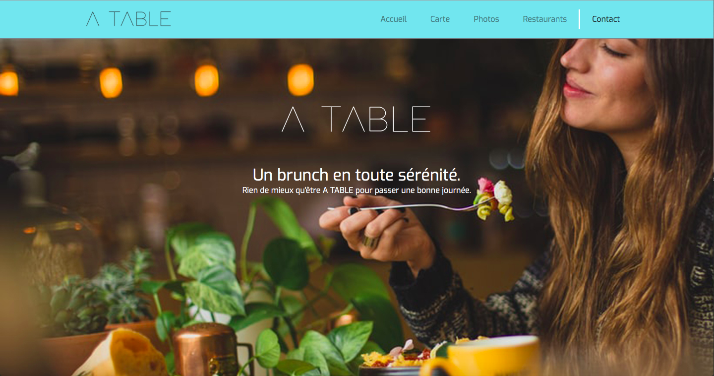

# Projet site de restaurant en Bootstrap - **A Table**

## Présentation du Projet

Projet créé le 07 Octobre 2019 dans le cadre de la formation Web Developer donnée par [BeCode](https://www.becode.org/), dans le but d'apprendre à utiliser Boostrap.

Le projet est réalisé sur base des [instructions données](https://github.com/becodeorg/CRL-Woods-2.15/blob/master/Projects/BootstrapProject/projet.md).

- [x] Codebase formated by [Prettier](https://prettier.io/)
- [x] Html validated by [W3C Markup Validation Service](https://validator.w3.org)

### **A Table**

Le Projet consiste en un site Bootstrap de 5 pages, pésentant notre concept de restaurant nommé **A Table**.

_Nous sommes un petit restaurant où l'on peut bruncher avec ses amis ou en famille. Vous pouvez retrouver chez nous toutes sortes de pâtisseries, des bagles, des tartines, des céréales et même quelques petit plats. De quoi bien manger dans une ambiance familiale et conviviale._.

## Contributeurs

- [**Denis Bourgeois**](https://github.com/Debourgeo)
- [**Kevin Labtani**](https://github.com/kevin-labtani)
- [**Gaby Pombo**](https://github.com/Gabypml)
- [**Christophe Ye Biname**](https://github.com/christophe-ye-biname)

## Commentaires

- **Kevin** (en charge de la _navbar_, du _footer_, de la page _contact_ et de ce _readme_):

  - J'ai appris à utiliser l'attribut `required` pour avoir une validation basique de mon formulaire par le navigateur web.
  - Suite à un audit **Google Lighthouse** de la page _contact.html_, j'ai rencontré des problèmes au niveau de l'accessibilité, que j'ai résolu en rajoutant un attribut `aria-label` au bouton. Celui-ci sert de `navbar-toggler` à Bootstrap, en rajoutant un `label` avec une classe custom `hidden` au `textarea` du formulaire, un "css trick" que j'ai trouvé sur [un sité dédié à l'accessibilité](https://webaim.org/techniques/css/invisiblecontent/), et en rajoutant un attribut `aria-hidden="true"` aux liens sociaux presents dans le footer.
  - De plus, suite à l'audit, j'ai rajouté un tag `meta description`.
  - J'ai aussi appris à générer et utiliser une _favicon_.

- **Denis** (en charge de la page _carte_ et de la page _restaurants_):

  - J'ai utilisé pour ces pages un mélange de `container`, `lists-groups` et de `cards`. Bien qu'étant un peu limité par les standards _bootstrap_, le résultat reste bon.
  - L'audit **Google Lighthouse** a montré de bons résultats dans l'ensemble, le validateur **W3C** a jugé la sémantique correcte.
  - L'utilisation de **git** se passe bien dans l'ensemble. Les conflits sont peu nombreux et facilement gérés.
  - Attention à la compréhension des consignes pour ma part (nom du repo, utilisation des `list-groups` à mauvais escient, ...)
  - Penser à limiter le nombre de "Hacks" utilisés pour parvenir au résultat attendu.

- **Gaby** (en charge de la page _acceuil_, du logo et du graphisme en général)

  - Nous sommes partis sur un design simple et minimaliste.
  - J'ai appris à utiliser `jumbotron` et les `card`.
  - J'ai utilisé des `row` et des `col` dans des `container` pour mes `card` pour pouvoir obtenir la disposition voulue.
  - L'utilisation de _Git_ se passe relativement bien, mais j'ai toujours peur de faire une bétise et de mettre tout le groupe dans l'embarras.

- **Christophe** (en charge de la gallerie):
  - J'ai appris un faire un carousel avec bootstrap et à y apporter certaines modifications.
  - Suite à un audit **Google Lighthouse** de la page _photos.html_ ,j'ai remarqué des problèmes au niveau de l'accessibilité que je n'ai su résoudre. Ces problèmes sont causés par des classes boostrap que je ne peux pas changer (ou ne vois pas comment).

## Langages

Projet réalisé entièrement en HTML, Sass & jQuery.

## Framework

[Bootstrap 4](https://getbootstrap.com/)

## Progression

Projet terminé le 11 Octobre 2019.

## Remerciements

- [BeCode](https://www.becode.org/) pour la formation.
- [Arnaud Duchemin](https://github.com/Cervant3s) pour le coaching.
- La promotion **CRL-Woods-2.15** pour l'aide et le support.
